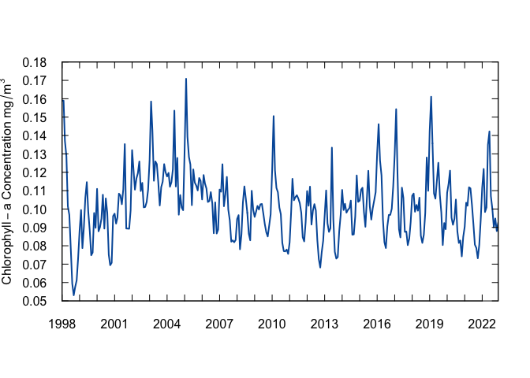
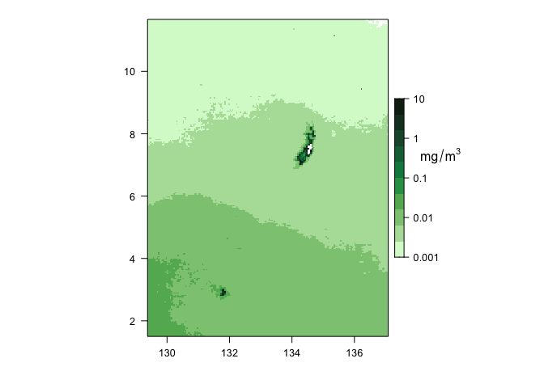

Chlorophyll Concentration
================
<phoebe.woodworth-jefcoats@noaa.gov>
2023-08-24

## **Indicator: Chlorophyll Concentration**

Phytoplankton are the foundation of the marine food web. Their abundance
affects food availability for all consumers, ranging from zooplankton to
apex predators. Chlorophyll concentration is used as a proxy for
phytoplankton abundance. Some climate change projections suggest a shift
towards lower phytoplankton abundances, particularly in the ocean’s
oligotrophic gyres. Chlorophyll concentration (and phytoplankton
abundance) varies greatly across the Pacific basin, with higher
concentrations generally found at higher latitudes and particularly
around coastlines. Chlorophyll concentrations also vary in response to
natural climate variability.

Chlorophyll-a concentration is estimated from satellite remotely sensed
observations of ocean color, which extend back to 1998. The basin-wide
average (1998 – 2021) is shown below. The Palau EEZ is also highlighted
as a spatial average (1998 – 2021) and a time series averaged over this
area. No significant trend in chlorophyll concentration was detected
over this region and time span.

``` r
### Load libraries
library(tidyverse)
library(lubridate)
library(here)
library(stringr)
library(nmfspalette)
library(rerddap)
```

``` r
### Load libraries for mapping
library(raster)
library(rasterVis)
library(mapdata)
library(maptools)
library(cmocean)
library(latticeExtra)
library(grid)
library(rerddap)
library(terra)
library(viridis)
```

``` r
# Set report year (RptYr), to make things easier
RptYr <- 2022

# Set path to variable: Sea_Surface_Temperature
# This is where the data are and where the plots will go
Dir <- here("Chlorophyll_Concentration")
```

``` r
### Load data
# Thanks to Melanie Abecassis and the OceanWatch training she led, whose code I'm borrowing here

# Bounding box, from John Marra via email:
lon_range <- c(129.4088, 137.0541)
lat_range <- c(1.5214, 11.6587)

# OceanWatch ERDDAP node
ERDDAP_Node <- "https://oceanwatch.pifsc.noaa.gov/erddap/"

# The variable name and other information can be found at the site above.
# I'm omitting the sleuthing from the code for the sake of brevity and
# because I'm familiar with the data.

# Access the data and all its attributes (this takes a bit)
chl_all <- griddap(url = ERDDAP_Node, 'esa-cci-chla-monthly-v6-0', 
               time = c('1998-01-01', paste(RptYr, '-12-01', sep = "")),
               latitude = lat_range, longitude = lon_range,
               fields = "chlor_a")
# Get just the chlorophyll data and its spatiotemporal coordinates
chl <- chl_all$data
```

``` r
# Monthly spatial average
chl_ts <- chl |>
  group_by(time) |>
  summarise(chlor_a = mean(chlor_a, na.rm = TRUE))
```

``` r
### Linear fit
n_obs <- seq(1, length(chl_ts$chlor_a), 1)
chl_lm <- lm(chl_ts$chlor_a ~ n_obs)

# summary(chl_lm) confirmed by a quick plot of the time series
# shows that there's no significant trend over time for this
# indicator.  Therefore, I'm going to leave out the code 
# related to quantifying and plotting change over time.
# This is something that can be added in in the future.
```

``` r
### Plot the time series
# Create axes limits to make things simpler
# These were determined through looking at quick rough plots and data limits
chl_xlim <- c(min(ymd_hms(chl_ts$time)), max(ymd_hms(chl_ts$time)))
chl_ylim <- c(0.05, 0.18)

# Access the NMFS color palette
oceans <- nmfs_palette("oceans")(3)

# Plot
plot(ymd_hms(chl_ts$time), chl_ts$chlor_a, type = "l", lwd = 2, col = oceans[2], 
     xlim = chl_xlim, ylim = chl_ylim, xlab = " ", ylab = expression(Chlorophyll-a~Concentration~mg/m^3),
     xaxt = "n", yaxt = "n", xaxs = "i", yaxs = "i")
axis((1), at = ymd_hms(chl_ts$time[seq(1, length(n_obs), 12)]), tck = 0.025, labels = year(make_date(seq(1998, RptYr, 1))))
axis((2), at = seq(0.05, 0.18, 0.01), tck = 0.025, las = 1)
axis((3), at = ymd_hms(chl_ts$time[seq(1, length(n_obs), 12)]), tck = 0.025, labels = FALSE)
axis((4), at = seq(0.05, 0.18, 0.01), tck = 0.025, labels = FALSE)
```

<!-- -->

``` r
# _axt = "n" removes tick labels so that they can be customized later 
# _axs = "i" removes whitespace beyond axes maxima
```

``` r
### Accessing data for long-term climatology
FirstYr= '1998-01-01T00:00:00Z'
datasetid = 'esa-cci-chla-1998-2021-clim-v6-0'

# Thanks to Johanna Wren, below section for making the raster map is based on her script

Dat <- griddap(url = ERDDAP_Node, datasetid ,  
                  time = c(FirstYr, FirstYr), 
                  latitude = lat_range, longitude = lon_range,
                    fields = 'chlor_a')

temp <- Dat$data
```

``` r
### Create a rasterbrick for mapping
#remove the time column
df <- temp[,-3]
#create a rasterlayer with 3-d dataframe
rst <- rasterFromXYZ(df)
#create a rasterbrick with the rasterlayer
chl_clim <- brick(rst)
```

``` r
### Mapping long-term climatology
# Get land information and make it into a spatial object
land <- maps::map('world', fill=TRUE, xlim=lon_range, ylim=lat_range, plot=FALSE)
ids <- sapply(strsplit(land$names, ":"), function(x) x[1])
bPols <- map2SpatialPolygons(land, IDs=ids, proj4string=CRS('+proj=longlat +datum=WGS84 +no_defs'))

# make map themes
mapTheme <- rasterTheme(region=cmocean('algae')(50))

# Make plot
#regular scale
levelplot(log(chl_clim), pretty=T, margin=F, par.setting=mapTheme, 
          at=seq(-3,1,by=0.4),
          colorkey=list( height = .5, width = 1,
                 labels=list(at=c(-4,-3, -2, -1, 0, 1, 2), 
                             labels=c("0.0001", "0.001", "0.01", "0.1", "1", "10", "100")) ) )
# add unit to colorbar
grid.text(expression(mg/m^3) , y=unit(0.6, "npc"), 
                x=unit(0.81, "npc"))    
```

<!-- -->
