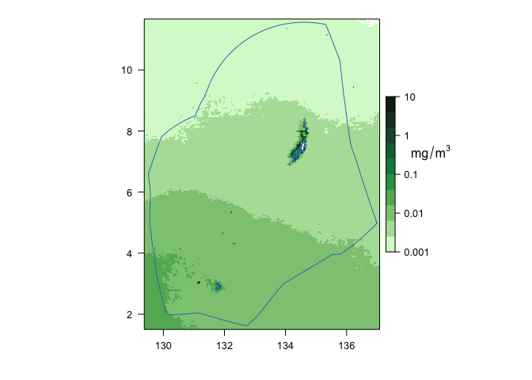

## **Indicator: Chlorophyll Concentration**

Phytoplankton are the foundation of the marine food web. Their abundance
affects food availability for all consumers, ranging from zooplankton to
apex predators. Chlorophyll concentration is used as a proxy for
phytoplankton abundance. Some climate change projections suggest a shift
towards lower phytoplankton abundances, particularly in the ocean’s
oligotrophic gyres. Chlorophyll concentration (and phytoplankton
abundance) varies greatly across the Pacific basin, with higher
concentrations generally found at higher latitudes and particularly
around coastlines. Chlorophyll concentrations also vary in response to
natural climate variability.

    ### Load libraries
    library(tidyverse)

    ## ── Attaching core tidyverse packages ──────────────────────── tidyverse 2.0.0 ──
    ## ✔ dplyr     1.1.2     ✔ readr     2.1.4
    ## ✔ forcats   1.0.0     ✔ stringr   1.5.0
    ## ✔ ggplot2   3.4.2     ✔ tibble    3.2.1
    ## ✔ lubridate 1.9.2     ✔ tidyr     1.3.0
    ## ✔ purrr     1.0.1     
    ## ── Conflicts ────────────────────────────────────────── tidyverse_conflicts() ──
    ## ✖ dplyr::filter() masks stats::filter()
    ## ✖ dplyr::lag()    masks stats::lag()
    ## ℹ Use the conflicted package (<http://conflicted.r-lib.org/>) to force all conflicts to become errors

    library(lubridate)
    library(here)

    ## here() starts at /Users/daisyhuishi/github/Palau-ocean-climate

    library(stringr)
    library(nmfspalette)
    library(rerddap)

    ### Load libraries for mapping
    library(raster)

    ## Loading required package: sp

    ## The legacy packages maptools, rgdal, and rgeos, underpinning the sp package,
    ## which was just loaded, will retire in October 2023.
    ## Please refer to R-spatial evolution reports for details, especially
    ## https://r-spatial.org/r/2023/05/15/evolution4.html.
    ## It may be desirable to make the sf package available;
    ## package maintainers should consider adding sf to Suggests:.
    ## The sp package is now running under evolution status 2
    ##      (status 2 uses the sf package in place of rgdal)

    ## 
    ## Attaching package: 'raster'

    ## The following object is masked from 'package:dplyr':
    ## 
    ##     select

    library(rasterVis)

    ## Loading required package: lattice

    library(mapdata)

    ## Loading required package: maps

    ## 
    ## Attaching package: 'maps'

    ## The following object is masked from 'package:purrr':
    ## 
    ##     map

    library(maptools)

    ## Please note that 'maptools' will be retired during October 2023,
    ## plan transition at your earliest convenience (see
    ## https://r-spatial.org/r/2023/05/15/evolution4.html and earlier blogs
    ## for guidance);some functionality will be moved to 'sp'.
    ##  Checking rgeos availability: FALSE

    library(cmocean)
    library(latticeExtra)

    ## 
    ## Attaching package: 'latticeExtra'

    ## The following object is masked from 'package:rasterVis':
    ## 
    ##     horizonplot

    ## The following object is masked from 'package:ggplot2':
    ## 
    ##     layer

    library(grid)
    library(rerddap)
    library(terra)

    ## terra 1.7.39

    ## 
    ## Attaching package: 'terra'

    ## The following object is masked from 'package:grid':
    ## 
    ##     depth

    ## The following object is masked from 'package:tidyr':
    ## 
    ##     extract

    library(viridis)

    ## Loading required package: viridisLite

    ## 
    ## Attaching package: 'viridis'

    ## The following object is masked from 'package:maps':
    ## 
    ##     unemp

    # Set report year (RptYr), to make things easier
    RptYr <- 2022

    # Set path to variable: Sea_Surface_Temperature
    # This is where the data are and where the plots will go
    Dir <- here("Chlorophyll_Concentration")

    ### Load data
    # Thanks to Melanie Abecassis and the OceanWatch training she led, whose code I'm borrowing here

    # Bounding box, from John Marra via email:
    lon_range <- c(129.4088, 137.0541)
    lat_range <- c(1.5214, 11.6587)

    # OceanWatch ERDDAP node
    ERDDAP_Node <- "https://oceanwatch.pifsc.noaa.gov/erddap/"

    # The variable name and other information can be found at the site above.
    # I'm omitting the sleuthing from the code for the sake of brevity and
    # because I'm familiar with the data.

    # Access the data and all its attributes (this takes a bit)
    chl_all <- griddap(url = ERDDAP_Node, 'esa-cci-chla-monthly-v6-0', 
                   time = c('1998-01-01', paste(RptYr, '-12-01', sep = "")),
                   latitude = lat_range, longitude = lon_range,
                   fields = "chlor_a")
    # Get just the chlorophyll data and its spatiotemporal coordinates
    chl <- chl_all$data

    # Monthly spatial average
    chl_ts <- chl |>
      group_by(time) |>
      summarise(chlor_a = mean(chlor_a, na.rm = TRUE))

    ### Linear fit
    n_obs <- seq(1, length(chl_ts$chlor_a), 1)
    chl_lm <- lm(chl_ts$chlor_a ~ n_obs)

    # summary(chl_lm) confirmed by a quick plot of the time series
    # shows that there's no significant trend over time for this
    # indicator.  Therefore, I'm going to leave out the code 
    # related to quantifying and plotting change over time.
    # This is something that can be added in in the future.

    ### Plot the time series
    # Create axes limits to make things simpler
    # These were determined through looking at quick rough plots and data limits
    chl_xlim <- c(min(ymd_hms(chl_ts$time)), max(ymd_hms(chl_ts$time)))
    chl_ylim <- c(0.05, 0.18)

    # Access the NMFS color palette
    oceans <- nmfs_palette("oceans")(3)

    # Plot
    plot(ymd_hms(chl_ts$time), chl_ts$chlor_a, type = "l", lwd = 2, col = oceans[2], 
         xlim = chl_xlim, ylim = chl_ylim, xlab = " ", ylab = expression(Chlorophyll-a~Concentration~mg/m^3),
         xaxt = "n", yaxt = "n", xaxs = "i", yaxs = "i")
    axis((1), at = ymd_hms(chl_ts$time[seq(1, length(n_obs), 12)]), tck = 0.025, labels = year(make_date(seq(1998, RptYr, 1))))
    axis((2), at = seq(0.05, 0.18, 0.01), tck = 0.025, las = 1)
    axis((3), at = ymd_hms(chl_ts$time[seq(1, length(n_obs), 12)]), tck = 0.025, labels = FALSE)
    axis((4), at = seq(0.05, 0.18, 0.01), tck = 0.025, labels = FALSE)

    # _axt = "n" removes tick labels so that they can be customized later 
    # _axs = "i" removes whitespace beyond axes maxima

    ### Accessing data for long-term climatology
    FirstYr= '1998-01-01T00:00:00Z'
    datasetid = 'esa-cci-chla-1998-2021-clim-v6-0'

    # Thanks to Johanna Wren, below section for making the raster map is based on her script

    Dat <- griddap(url = ERDDAP_Node, datasetid ,  
                      time = c(FirstYr, FirstYr), 
                      latitude = lat_range, longitude = lon_range,
                        fields = 'chlor_a')

    temp <- Dat$data

    ### Create a rasterbrick for mapping
    #remove the time column
    df <- temp[,-3]
    #create a rasterlayer with 3-d dataframe
    rst <- rasterFromXYZ(df)
    #create a rasterbrick with the rasterlayer
    chl_clim <- brick(rst)

    ### Mapping long-term climatology
    # Get land information and make it into a spatial object
    land <- maps::map('world', fill=TRUE, xlim=lon_range, ylim=lat_range, plot=FALSE)
    ids <- sapply(strsplit(land$names, ":"), function(x) x[1])
    bPols <- map2SpatialPolygons(land, IDs=ids, proj4string=CRS('+proj=longlat +datum=WGS84 +no_defs'))

    # Add EEZ
    llines.SpatVector <- function(x, ...) {
      xy <- crds(x, list=TRUE)
      names(xy) <- c("x", "y")
      lattice::llines(xy, ...)
    }
    f <- "eez/eez.shp"
    v <- vect(f)
    lns <- as.lines(v)

    # make map themes
    mapTheme <- rasterTheme(region=cmocean('algae')(50))

    # Make plot
    #regular scale
    levelplot(log(chl_clim), pretty=T, margin=F, par.setting=mapTheme, 
              at=seq(-3,1,by=0.4),
              colorkey=list( height = .5, width = 1,
                     labels=list(at=c(-4,-3, -2, -1, 0, 1, 2), 
                                 labels=c("0.0001", "0.001", "0.01", "0.1", "1", "10", "100")) ) )+ layer(sp.polygons(bPols)) + layer(llines(lns))

    # add unit to colorbar
    grid.text(expression(mg/m^3) , y=unit(0.6, "npc"), 
                    x=unit(0.81, "npc"))    

Chlorophyll-a concentration is estimated from satellite remotely sensed
observations of ocean color, which extend back to 1998. The basin-wide
average (1998 – 2021) is shown below. The Palau EEZ is also highlighted
as a spatial average (1998 – 2021) and a time series averaged over this
area. No significant trend in chlorophyll concentration was detected
over this region and time span.
