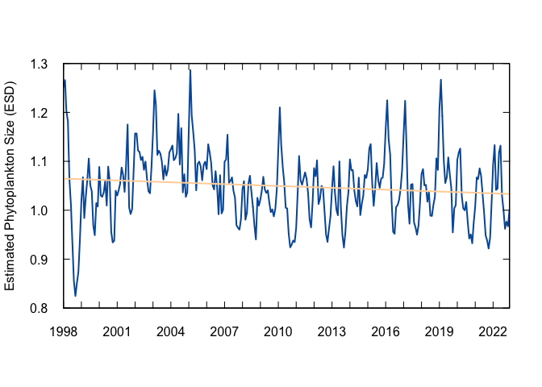
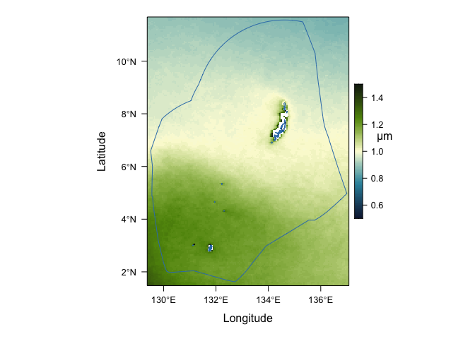

## **Indicator: Estimated Phytoplankton Size**

Phytoplankton size provides insight into ecosystem productivity with
larger phytoplankton generally supporting more productive ecosystems
with larger fish. Some climate change projections suggest a shift
towards smaller phytoplankton, particularly in the ocean’s oligotrophic
gyres, potentially reducing food available to all trophic levels.
Phytoplankton size varies greatly across the Pacific basin, with larger
phytoplankton generally found at higher latitudes and closer to
coastlines.  
Phytoplankton size also varies with natural climate cycles such as ENSO,
with larger phytoplankton more prevalent across the equatorial Pacific
during cooler La Niña periods and vice versa during El Niño.

    ### Load libraries
    library(tidyverse)

    ## ── Attaching core tidyverse packages ──────────────────────── tidyverse 2.0.0 ──
    ## ✔ dplyr     1.1.2     ✔ readr     2.1.4
    ## ✔ forcats   1.0.0     ✔ stringr   1.5.0
    ## ✔ ggplot2   3.4.2     ✔ tibble    3.2.1
    ## ✔ lubridate 1.9.2     ✔ tidyr     1.3.0
    ## ✔ purrr     1.0.1     
    ## ── Conflicts ────────────────────────────────────────── tidyverse_conflicts() ──
    ## ✖ dplyr::filter() masks stats::filter()
    ## ✖ dplyr::lag()    masks stats::lag()
    ## ℹ Use the conflicted package (<http://conflicted.r-lib.org/>) to force all conflicts to become errors

    library(lubridate)
    library(here)

    ## here() starts at /Users/daisyhuishi/github/Palau-ocean-climate

    library(stringr)
    library(nmfspalette)
    library(rerddap)

    ### Load libraries for mapping
    library(raster)

    ## Loading required package: sp

    ## The legacy packages maptools, rgdal, and rgeos, underpinning the sp package,
    ## which was just loaded, will retire in October 2023.
    ## Please refer to R-spatial evolution reports for details, especially
    ## https://r-spatial.org/r/2023/05/15/evolution4.html.
    ## It may be desirable to make the sf package available;
    ## package maintainers should consider adding sf to Suggests:.
    ## The sp package is now running under evolution status 2
    ##      (status 2 uses the sf package in place of rgdal)

    ## 
    ## Attaching package: 'raster'

    ## The following object is masked from 'package:dplyr':
    ## 
    ##     select

    library(rasterVis)

    ## Loading required package: lattice

    library(mapdata)

    ## Loading required package: maps

    ## 
    ## Attaching package: 'maps'

    ## The following object is masked from 'package:purrr':
    ## 
    ##     map

    library(maptools)

    ## Please note that 'maptools' will be retired during October 2023,
    ## plan transition at your earliest convenience (see
    ## https://r-spatial.org/r/2023/05/15/evolution4.html and earlier blogs
    ## for guidance);some functionality will be moved to 'sp'.
    ##  Checking rgeos availability: FALSE

    library(cmocean)
    library(latticeExtra)

    ## 
    ## Attaching package: 'latticeExtra'

    ## The following object is masked from 'package:rasterVis':
    ## 
    ##     horizonplot

    ## The following object is masked from 'package:ggplot2':
    ## 
    ##     layer

    library(grid)
    library(rerddap)
    library(terra)

    ## terra 1.7.39

    ## 
    ## Attaching package: 'terra'

    ## The following object is masked from 'package:grid':
    ## 
    ##     depth

    ## The following object is masked from 'package:tidyr':
    ## 
    ##     extract

    library(viridis)

    ## Loading required package: viridisLite

    ## 
    ## Attaching package: 'viridis'

    ## The following object is masked from 'package:maps':
    ## 
    ##     unemp

    library(sf)

    ## Linking to GEOS 3.11.0, GDAL 3.5.3, PROJ 9.1.0; sf_use_s2() is TRUE

    # Set report year (RptYr), to make things easier
    RptYr <- 2022

    # Set path to variable: Sea_Surface_Temperature
    # This is where the data are and where the plots will go
    Dir <- here("Estimated_Phytoplankton_Size")

    ### Load data
    # Thanks to Melanie Abecassis and the OceanWatch training she led, whose code I'm borrowing here

    # Bounding box, from John Marra via email:
    lon_range <- c(129.4088, 137.0541)
    lat_range <- c(1.5214, 11.6587)

    # OceanWatch ERDDAP node
    ERDDAP_Node <- "https://oceanwatch.pifsc.noaa.gov/erddap/"

    # The variable name and other information can be found at the site above.
    # I'm omitting the sleuthing from the code for the sake of brevity and
    # because I'm familiar with the data.

    # Access the data and all its attributes (this takes a bit)
    md50_all <- griddap(url = ERDDAP_Node, 'md50_exp', 
                   time = c('1998-01-01T00:00:00Z', paste(RptYr, '-12-01T00:00:00Z', sep = "")),
                   latitude = lat_range, longitude = lon_range,
                   fields = "MD50")
    # Get just the chlorophyll data and its spatiotemporal coordinates
    md50 <- md50_all$data

    # Monthly spatial average
    md50_ts <- md50 |>
      group_by(time) |>
      summarise(MD50 = mean(MD50, na.rm = TRUE))

    ### Linear fit
    n_obs <- seq(1, length(md50_ts$MD50), 1)
    md50_lm <- lm(md50_ts$MD50 ~ n_obs)

    # summary(md50_lm) shows that there's a weakly significant 
    # trend over time for this indicator.  There are some automated
    # checks that can be added to make sure this is still the case
    # in future years.

    # Change over time
    delta_md50 <- md50_lm$fitted.values[length(n_obs)] - md50_lm$fitted.value[1]

    # Note that this needs to be 'echo' and not 'include' so the figure will show up

    ### Plot the time series
    # Create axes limits to make things simpler
    # These were determined through looking at quick rough plots and data limits
    md50_xlim <- c(min(ymd_hms(md50_ts$time)), max(ymd_hms(md50_ts$time)))
    md50_ylim <- c(0.8, 1.3)

    # Access the NMFS color palette
    oceans <- nmfs_palette("oceans")(3)
    crustacean <- nmfs_palette("crustacean")(4)

    # Plot
    plot(ymd_hms(md50_ts$time), md50_ts$MD50, type = "l", lwd = 2, col = oceans[2], 
         xlim = md50_xlim, ylim = md50_ylim, xlab = " ", ylab = "Estimated Phytoplankton Size (ESD)",
         xaxt = "n", yaxt = "n", xaxs = "i", yaxs = "i")
    par(new = TRUE)
    plot(ymd_hms(md50_ts$time), md50_lm$fitted.values, type = "l", lwd = 2, col = crustacean[1], 
         xlim = md50_xlim, ylim = md50_ylim, xlab = " ", ylab = " ",
         xaxt = "n", yaxt = "n", xaxs = "i", yaxs = "i")
    axis((1), at = ymd_hms(md50_ts$time[seq(1, length(n_obs), 12)]), tck = 0.025, labels = year(make_date(seq(1998, RptYr, 1))))
    axis((2), at = seq(0.8, 1.3, 0.1), tck = 0.025, las = 1)
    axis((3), at = ymd_hms(md50_ts$time[seq(1, length(n_obs), 12)]), tck = 0.025, labels = FALSE)
    axis((4), at = seq(0.8, 1.3, 0.1), tck = 0.025, labels = FALSE)

    # _axt = "n" removes tick labels so that they can be customized later 
    # _axs = "i" removes whitespace beyond axes maxima

    ### Mapping long-term climatology
    FirstYr= '1998-01-01T00:00:00Z'
    datasetid = 'md50_exp-1998-2021-clim'

    # Thanks to Johanna Wren, below section for making the raster map is based on her script

    # Download data from erddap and save it to .nc file
    # Comment below out if you have already downloaded and saved the .nc file

    Dat <- griddap(url = ERDDAP_Node, datasetid ,  
                      latitude = lat_range, longitude = lon_range,
                        fields = 'MD50',
                        store=disk('md50data'))

    # Read in the files
    files <- list.files('md50data/', full.names = T)
    # Read the file into R and combine as stack and sort them after the date (name)
    md50_clim <- brick(files)

    # Get land information and make it into a spatial object
    land <- maps::map('world', fill=TRUE, xlim=lon_range, ylim=lat_range, plot=FALSE)
    ids <- sapply(strsplit(land$names, ":"), function(x) x[1])
    bPols <- map2SpatialPolygons(land, IDs=ids, proj4string=CRS('+proj=longlat +datum=WGS84 +no_defs'))

    # Add EEZ
    llines.SpatVector <- function(x, ...) {
      xy <- crds(x, list=TRUE)
      names(xy) <- c("x", "y")
      lattice::llines(xy, ...)
    }
    f <- "eez/eez.shp"
    v <- vect(f)
    lns <- as.lines(v)

    # make map themes
    mapTheme <- rasterTheme(region=cmocean("delta")(5))

    # Make plot
    levelplot(md50_clim, pretty=T, margin=F, par.setting=mapTheme,  
              at=seq(0.5,1.5,by=0.01),
              colorkey=list( height = .5, width = 1)) + layer(sp.polygons(bPols)) + layer(llines(lns))
    # add unit to colorbar
    grid.text('μm' , y=unit(0.6, "npc"), 
                    x=unit(0.81, "npc"))  

Estimated median phytoplankton size can be derived from satellite
remotely sensed sea surface temperature and chlorophyll-a concentration.
The basin-wide average (1998 – 2021) is shown below. The Palau EEZ is
also highlighted as a spatial average (1998 – 2021) and a time series
averaged over this area. A statistically significant (p &lt; 0.05)
decline in estimated median phytoplankton size was detected over this
area. From 1998 through 2022, estimated median phytoplankton size
declined by 0.031 *μ*m Equivalent Spherical Diameter (ESD).
