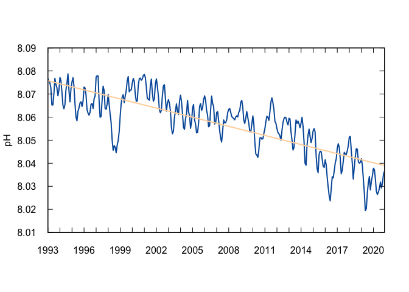
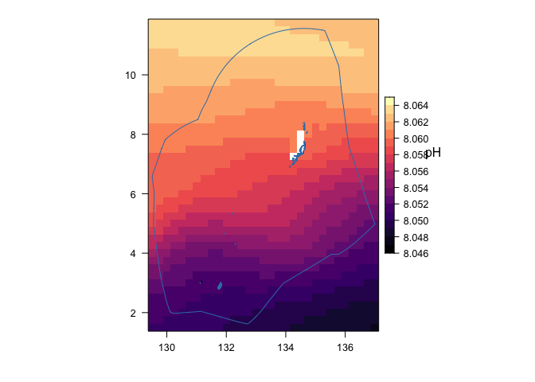

## **Indicator: Oceanic pH**

Oceanic pH is a measure of how greenhouse gas emissions have already
impacted the ocean. This indicator demonstrates that oceanic pH has
decreased significantly over the past several decades (i.e., the ocean
has become more acidic). Increasing ocean acidification limits the
ability of marine organisms to build shells and other calcareous
structures. Recent research has shown that pelagic organisms such as
pteropods and other prey for commercially valuable fish species are
already being negatively impacted by increasing acidification (Feely et
al. 2016). The full impact of ocean acidification on the pelagic food
web is an area of active research (Fabry et al. 2008).

    ### Load libraries
    library(tidyverse)

    ## ── Attaching core tidyverse packages ──────────────────────── tidyverse 2.0.0 ──
    ## ✔ dplyr     1.1.2     ✔ readr     2.1.4
    ## ✔ forcats   1.0.0     ✔ stringr   1.5.0
    ## ✔ ggplot2   3.4.2     ✔ tibble    3.2.1
    ## ✔ lubridate 1.9.2     ✔ tidyr     1.3.0
    ## ✔ purrr     1.0.1     
    ## ── Conflicts ────────────────────────────────────────── tidyverse_conflicts() ──
    ## ✖ dplyr::filter() masks stats::filter()
    ## ✖ dplyr::lag()    masks stats::lag()
    ## ℹ Use the conflicted package (<http://conflicted.r-lib.org/>) to force all conflicts to become errors

    library(lubridate)
    library(here)

    ## here() starts at /Users/daisyhuishi/github/Palau-ocean-climate

    library(stringr)
    library(nmfspalette)
    library(ncdf4) 

    ### Load libraries for mapping
    library(raster)

    ## Loading required package: sp

    ## The legacy packages maptools, rgdal, and rgeos, underpinning the sp package,
    ## which was just loaded, will retire in October 2023.
    ## Please refer to R-spatial evolution reports for details, especially
    ## https://r-spatial.org/r/2023/05/15/evolution4.html.
    ## It may be desirable to make the sf package available;
    ## package maintainers should consider adding sf to Suggests:.
    ## The sp package is now running under evolution status 2
    ##      (status 2 uses the sf package in place of rgdal)

    ## 
    ## Attaching package: 'raster'

    ## The following object is masked from 'package:dplyr':
    ## 
    ##     select

    library(rasterVis)

    ## Loading required package: lattice

    library(mapdata)

    ## Loading required package: maps

    ## 
    ## Attaching package: 'maps'

    ## The following object is masked from 'package:purrr':
    ## 
    ##     map

    library(maptools)

    ## Please note that 'maptools' will be retired during October 2023,
    ## plan transition at your earliest convenience (see
    ## https://r-spatial.org/r/2023/05/15/evolution4.html and earlier blogs
    ## for guidance);some functionality will be moved to 'sp'.
    ##  Checking rgeos availability: FALSE

    library(cmocean)
    library(latticeExtra)

    ## 
    ## Attaching package: 'latticeExtra'

    ## The following object is masked from 'package:rasterVis':
    ## 
    ##     horizonplot

    ## The following object is masked from 'package:ggplot2':
    ## 
    ##     layer

    library(grid)
    library(rerddap)
    library(terra)

    ## terra 1.7.39

    ## 
    ## Attaching package: 'terra'

    ## The following object is masked from 'package:grid':
    ## 
    ##     depth

    ## The following object is masked from 'package:tidyr':
    ## 
    ##     extract

    library(viridis)

    ## Loading required package: viridisLite

    ## 
    ## Attaching package: 'viridis'

    ## The following object is masked from 'package:maps':
    ## 
    ##     unemp

    # Set report year (RptYr), to make things easier
    RptYr <- 2020

    # Set path to variable: Sea_Surface_Temperature
    # This is where the data are and where the plots will go
    Dir <- here("Oceanic_pH")

    ### Load data
    # Bounding box, from John Marra via email:
    lon_range <- c(129.4088, 137.0541)
    lat_range <- c(1.5214, 11.6587)

    #pre-downloaded netCDF file for pH at 5.14 m within the Palau domain (1,5-11.75N,129.5-137W)
    fn="ph_palau.nc"
    ph_data <- nc_open(fn)
    ph <- ncvar_get(ph_data, "ph")
    time <- ncvar_get(ph_data, "time")
    nc_close(ph_data) 

    # Change time from hours to year-month-date format
    time_df <- as.data.frame.table(as.POSIXct(time*3600 ,origin='1950-01-01 00:00'))[2]#['Freq']
    colnames(time_df) <- c('time')

    # Monthly spatial average
    ph_df=as.data.frame(apply(ph, c(3), mean, na.rm = TRUE))
    colnames(ph_df) <- c('pH')

    ph_ts <- data.frame(time_df, ph_df)

    ### Linear fit
    n_obs <- seq(1, length(ph_ts$pH), 1)
    ph_lm <- lm(ph_ts$pH~ n_obs)
    # summary(ph_lm) shows that there's a significant decreasing
    # trend over time for this indicator.  There are some automated
    # checks that can be added to make sure this is still the case
    # in future years.

    # Change over time
    delta_ph <- ph_lm$fitted.values[length(n_obs)] - ph_lm$fitted.value[1]

    ### Plot the time series
    # Create axes limits to make things simpler
    # These were determined through looking at quick rough plots and data limits
    ph_xlim <- c(min(ymd_hms(ph_ts$time)), max(ymd_hms(ph_ts$time)))
    ph_ylim <- c(8.01, 8.09)

    # Access the NMFS color palette
    oceans <- nmfs_palette("oceans")(3)
    crustacean <- nmfs_palette("crustacean")(4)

    # Plot
    plot(ymd_hms(ph_ts$time), ph_ts$pH, type = "l", lwd = 2, col = oceans[2], 
         xlim = ph_xlim, ylim = ph_ylim, xlab = " ", ylab = "pH",
         xaxt = "n", yaxt = "n", xaxs = "i", yaxs = "i")
    par(new = TRUE)
    plot(ymd_hms(ph_ts$time), ph_lm$fitted.values, type = "l", lwd = 2, col = crustacean[1], 
         xlim = ph_xlim, ylim = ph_ylim, xlab = " ", ylab = " ",
         xaxt = "n", yaxt = "n", xaxs = "i", yaxs = "i")
    axis((1), at = ymd_hms(ph_ts$time[seq(1, length(n_obs), 12)]), tck = 0.025, labels = year(make_date(seq(1993, RptYr, 1))))
    axis((2), at = seq(8.01, 8.09, 0.01), tck = 0.025, las = 1)
    axis((3), at = ymd_hms(ph_ts$time[seq(1, length(n_obs), 12)]), tck = 0.025, labels = FALSE)
    axis((4), at = seq(8.01, 8.09, 0.01), tck = 0.025, labels = FALSE)

    # _axt = "n" removes tick labels so that they can be customized later 
    # _axs = "i" removes whitespace beyond axes maxima

    # Read the file into R and make it to rasterstack
    stack_ph = stack(fn)
    # Convert raster data to dataframe for calculating climatology
    df_temp = as.data.frame(rasterToPoints(stack_ph))
    df_temp$z = rowMeans(df_temp[,3:dim(df_temp)[2]], na.rm = T)
    # Convert dataframe to raster for mapping
    rst = rasterFromXYZ(df_temp[,c("x", "y", "z")])
    #create a rasterbrick with the rasterlayer
    ph_clim <- brick(rst)

    ### Mapping long-term climatology
    # Get land information and make it into a spatial object
    land <- maps::map('world', fill=TRUE, xlim=lon_range, ylim=lat_range, plot=FALSE)
    ids <- sapply(strsplit(land$names, ":"), function(x) x[1])
    bPols <- map2SpatialPolygons(land, IDs=ids, proj4string=CRS('+proj=longlat +datum=WGS84 +no_defs'))

    # Add EEZ
    llines.SpatVector <- function(x, ...) {
      xy <- crds(x, list=TRUE)
      names(xy) <- c("x", "y")
      lattice::llines(xy, ...)
    }
    f <- "eez/eez.shp"
    v <- vect(f)
    lns <- as.lines(v)

    # make map themes
    mapTheme <- rasterTheme(region=cmocean('algae')(50))

    # Make plot
    #regular scale

    levelplot(ph_clim , pretty=T, margin=F,   colorkey=list( height = .5, width = 1) ) + layer(sp.polygons(bPols)) + layer(llines(lns))

    # add unit to colorbar
    grid.text(expression(pH) , y=unit(0.6, "npc"), 
                    x=unit(0.81, "npc"))    

Oceanic pH is simulated by biogeochemical models using ocean and
atmosphere reanalyses as forcings. It spans from 1993 to 2020 and is
provided by Copernicus
(<https://data.marine.copernicus.eu/product/GLOBAL_MULTIYEAR_BGC_001_029/description>).
A highly significant (p&lt;0.001) decreasing trend is found in the pH of
Palau waters (5m) from 1993 to 2020, and pH declined by 0.037 over this
period.
